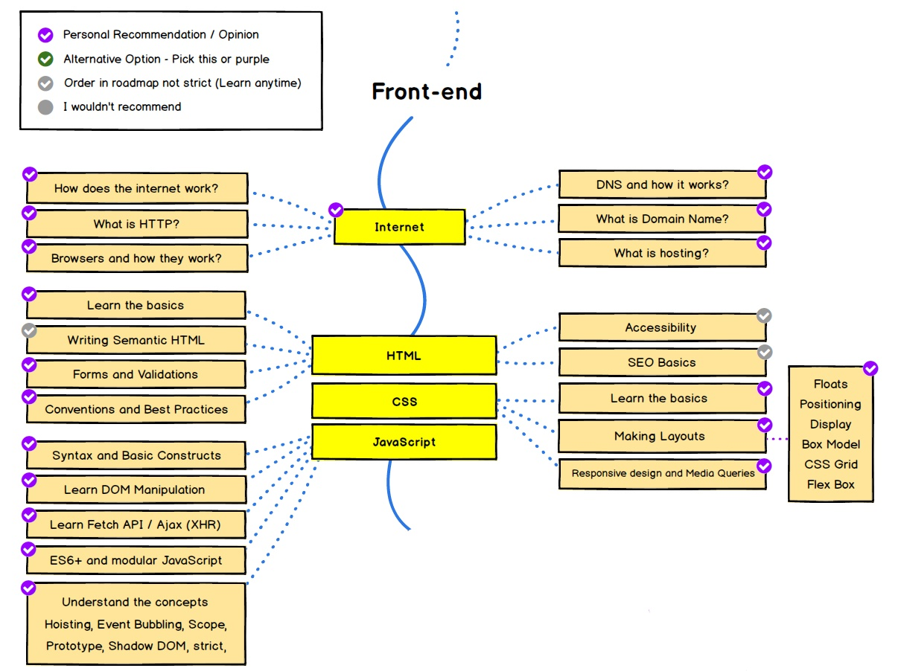

# HTML, CSS and JavaScript

This roadmap is an introduction to the front-end development of web. It is aimed at those who have no experience with web development, and should be filtered based on prior knowledge.

This section covers the basics of [**front-end developer roadmap**](hhttps://roadmap.sh/frontend). It is also recommended to follow with the [roadmap resource](https://roadmap.sh/frontend/resources)

## HTML and CSS

- [ ] [**HTML 5**](https://developer.mozilla.org/en-US/docs/Web/Guide/HTML/HTML5)
  - [ ] 📝 [**Basic HTML and HTML5** | by FreeCodeCamp](https://learn.freecodecamp.org/responsive-web-design/basic-html-and-html5)
  - [ ] 📝 [**Basic CSS** | by FreeCodeCamp](https://learn.freecodecamp.org/responsive-web-design/basic-css)\*
- [ ] [**Flexbox**](https://developer.mozilla.org/en-US/docs/Web/CSS/CSS_Flexible_Box_Layout/Basic_Concepts_of_Flexbox)
  - [ ] 📗 [**A Complete Guide to Flexbox** | by CSS Tricks](https://css-tricks.com/snippets/css/a-guide-to-flexbox/)
  - [ ] 📝 [**CSS Flexbox Challenges** | by FreeCodeCamp](https://learn.freecodecamp.org/responsive-web-design/css-flexbox)\*
- [ ] [**CSS Grid**](https://developer.mozilla.org/en-US/docs/Web/CSS/grid)
  - [ ] 📗 [**A Complete Guide to CSS Grid** | by CSS Tricks](https://css-tricks.com/snippets/css/complete-guide-grid/)
  - [ ] 📝 [**CSS Grid Challenges** | by FreeCodeCamp](https://learn.freecodecamp.org/responsive-web-design/css-grid)\*
- [ ] 🎓 📺 [**Responsive Web Design Fundamentals** | by Udacity ](https://www.udacity.com/course/responsive-web-design-fundamentals--ud893)\*

### Projects

- [ ] 🏁 [**Home Town App** | project for Responsive Web Design Fundamentals by Udacity](https://classroom.udacity.com/courses/ud893/lessons/3494350031/concepts/ae44eb8e-be6c-4f40-b31f-db5d80407d77) \* 
- [ ] 🏁 [**Responsive Web Design Projects** | by FreeCodeCamp*](https://learn.freecodecamp.org/responsive-web-design/responsive-web-design-projects)\* 
  - [ ] 🎯 [Tribute Page](https://learn.freecodecamp.org/responsive-web-design/responsive-web-design-projects/build-a-tribute-page/)
  - [ ] 🎯 [Survey Form](https://learn.freecodecamp.org/responsive-web-design/responsive-web-design-projects/build-a-survey-form/)
  - [ ] 🎯 [Product Landing Page](https://learn.freecodecamp.org/responsive-web-design/responsive-web-design-projects/build-a-product-landing-page)
  - [ ] 🎯 [Technical Documentation Page](https://learn.freecodecamp.org/responsive-web-design/responsive-web-design-projects/build-a-technical-documentation-page)
  - [ ] 🎯 [Personal Portfolio Webpage](https://learn.freecodecamp.org/responsive-web-design/responsive-web-design-projects/build-a-personal-portfolio-webpage/)

## Javascript

**Recommended readings**

- 📚 [**Eloquent JavaScript**](http://eloquentjavascript.net/)
- 📚 [**The Modern Javascript**](http://javascript.info/)

#### Language Concepts and Fundamentals

- [ ] 📚 📺 [**Introduction to JavaScript**](https://scrimba.com/g/gintrotojavascript)
- [ ] 📚 📺 [**Learn JavaScript in One Week**](https://coderbyte.com/course/learn-javascript-in-one-week)

#### Challenges

- [ ] 📝 [Basic JavaScript](https://learn.freecodecamp.org/javascript-algorithms-and-data-structures/basic-javascript/)\*
- [ ] 📝 [ES6](https://learn.freecodecamp.org/javascript-algorithms-and-data-structures/es6)\*
- [ ] 📝 [Debugging](https://learn.freecodecamp.org/javascript-algorithms-and-data-structures/debugging)\*
- [ ] 📝 [Basic Data Structures](https://learn.freecodecamp.org/javascript-algorithms-and-data-structures/basic-data-structures)\*
- [ ] 📝 [Object Oriented Programming](https://learn.freecodecamp.org/javascript-algorithms-and-data-structures/object-oriented-programming)

#### In-Browser Javascript

- [ ] 📗 [**The Document Object Model** | chapter de Eloquent JavaScript](http://eloquentjavascript.net/14_dom.html) \*
- [ ] 🎓 [**Intro to JavaScript** | by Udacity](https://www.udacity.com/course/intro-to-javascript--ud803)\*
- [ ] 📺 [**JavaScript DOM - Crash Course** | by Traversy Media](https://youtu.be/0ik6X4DJKCc?list=PLillGF-RfqbbnEGy3ROiLWk7JMCuSyQtX) \*
- [ ] 📗 [**AJAX** | by MDN](https://developer.mozilla.org/en-US/docs/Web/Guide/AJAX)
  - [ ] 📝 [**Json APIs and AJAX** | by FreeCodeCamp ](https://learn.freecodecamp.org/data-visualization/json-apis-and-ajax/access-the-json-data-from-an-api)
  - [ ] 📗 [**You Don't Need jQuery**](https://blog.garstasio.com/you-dont-need-jquery/)
  - [ ] 📗 [**HTTP Requests using Fetch API**](https://medium.freecodecamp.org/a-practical-es6-guide-on-how-to-perform-http-requests-using-the-fetch-api-594c3d91a547)

## Libraries and Tools

- [ ] [**Bootstrap**](https://getbootstrap.com/)
  - [ ] 📝 [**Bootstrap** | by FreeCodeCamp](https://learn.freecodecamp.org/front-end-libraries/bootstrap) \*
- [ ] [**jQuery**](https://api.jquery.com/)
  - [ ] 🎓 📺 [**Intro to jQuery** | by Udacity](https://classroom.udacity.com/courses/ud245)
  - [ ] 📺 [**jQuery in 15 minutes** | by DevTips](https://www.youtube.com/watch?v=v-RC3kJCL4c)
  - [ ] 📝 [**jQuery Tutorial** | by FreeCodeCamp ](https://learn.freecodecamp.org/front-end-libraries/jquery)

### Projects

- [ ] 🏁 [Random Quote Machine](https://learn.freecodecamp.org/front-end-libraries/front-end-libraries-projects/build-a-random-quote-machine/)
- [ ] 🏁 [Local Weather](https://learn.freecodecamp.org/coding-interview-prep/take-home-projects/show-the-local-weather/)
- [ ] 🏁 [Twitch Json API](https://learn.freecodecamp.org/coding-interview-prep/take-home-projects/use-the-twitch-json-api/)

---

### Icon semantics

📗 `Reference/Guide/Tutorial` | 📚 `Book` | 🎓 `Course` | 📺`Video` | 📝 `Guided activity` | 🏁 `Project` | 🎯 `To-do`
